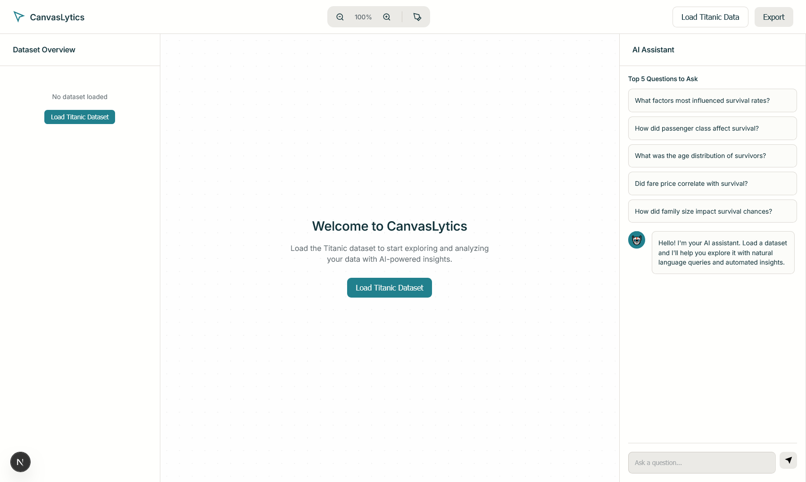
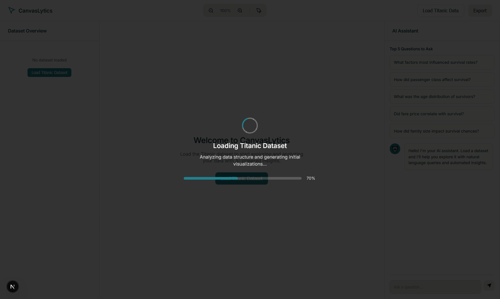
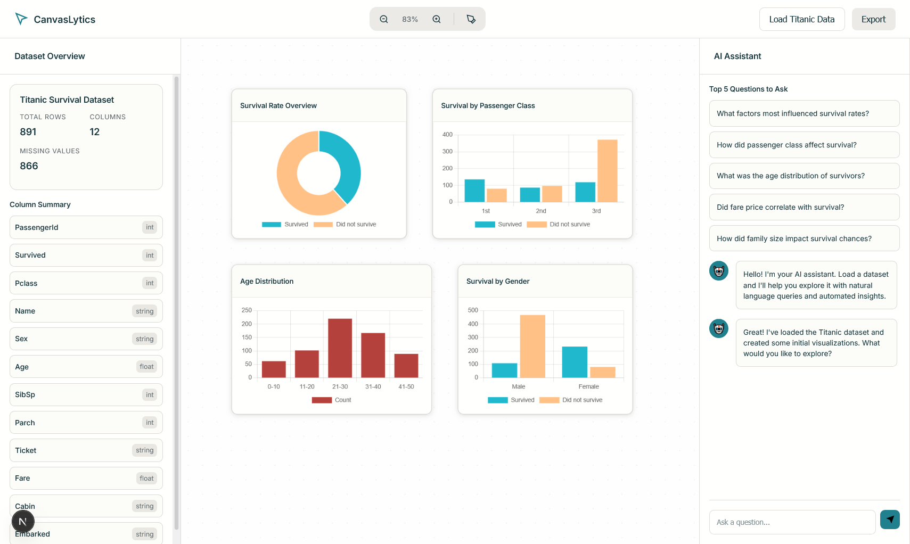
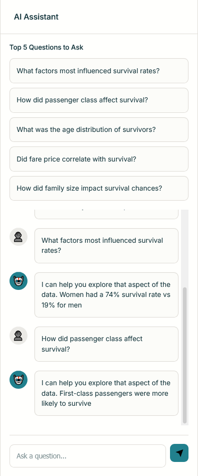
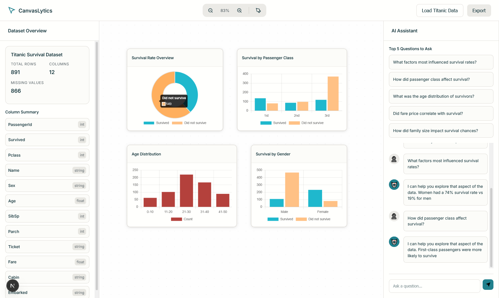
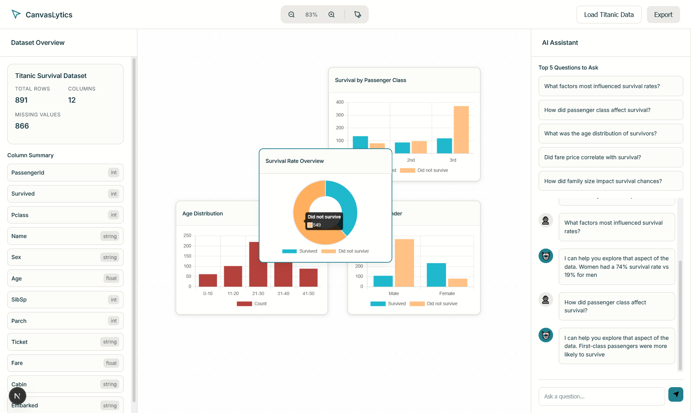
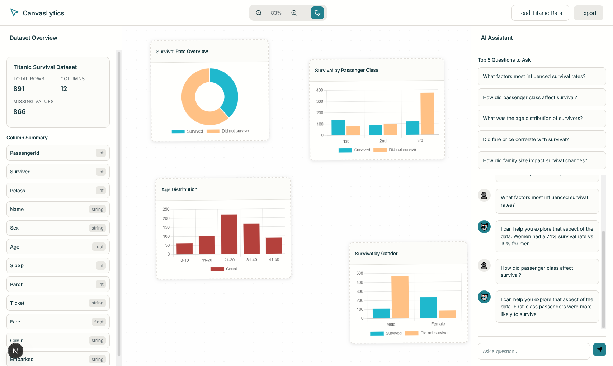
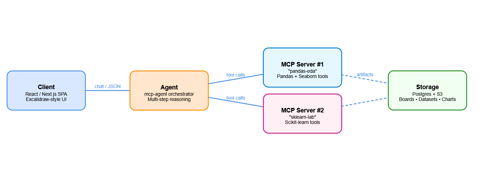

# CanvasLytics [[Live](https://client-8l4z.onrender.com) | [GitHub](https://github.com/SinghArindam/CanvasLytics)]

*Natural-language data exploration and baseline modelling on an infinite, Excalidraw-style canvas.*
---

Services :

1. Agent Service
2. Pandas EDA Service [Live](https://pandas-eda.onrender.com)
3. Scikit-learn Lab Service [Live](https://sklearn-lab.onrender.com)
4. Frontend Client Service [Live](https://client-8l4z.onrender.com)

---
### Landing Page


---
### Loading


---
### Titanic Dataset


---

---
### AI Assistant


---

---
### Titanic Dataset


---

---
### Titanic Dataset


---

---
### Titanic Dataset


---

---
## Architecture
| Layer | Component | Purpose |
|-------|-----------|---------|
| Client | React / Next.js SPA | Infinite-canvas UI; communicates over WebSockets for live updates. |
| Agent  | `mcp-agent` | Routes user requests to the appropriate MCP tool and manages multi-step workflows. |
| MCP-EDA | `pandas-eda` | `load_csv`, `describe`, `missing_values`, `plot_hist`, `plot_corr` (Pandas + Seaborn). |
| MCP-ML  | `sklearn-lab` | `train_model`, `evaluate_model`, `feature_importance` (scikit-learn). |
| Storage | Postgres + object store | Persists boards, datasets, and generated charts. |



---

## Key Features
| Group | Functionality |
|-------|---------------|
| **Data sourcing** | One-click load of the public Titanic CSV and automatic schema detection. |
| **Exploratory data analysis** | Descriptive statistics, correlation matrix, missing-value heat-map, and an agent-generated list of suggested follow-up questions. |
| **Visual analytics** | Movable, resizable charts (histogram, box-plot, scatter, stacked bar) rendered with Vega-Lite; optional hand-drawn overlay to mirror Excalidraw’s sketch style. |
| **Model prototyping** | Wizard that trains a baseline scikit-learn pipeline on a user-selected target, then reports accuracy, ROC-AUC, and feature importance; model artefact can be downloaded as a pickle file. |
| **Narrative & sharing** | Auto-generated text summary of EDA findings and model metrics, plus export to PNG, PDF, or read-only share link; per-session version history. |
| **Performance** | Two MCP servers—one for pandas-based EDA tasks, one for scikit-learn modelling—handle requests concurrently; the front-end can stream partial results so long-running jobs do not freeze the UI. |

---

## Excalidraw-Inspired UX
• Single five-colour palette (neutral greys, two blue accents)  
• Consistent 24 px grid and generous whitespace  
• Shared component library for buttons, menus, and tool-tips  
• Toggle to switch charts between clean vector and sketch mode

---

## Quick Start & Local Development
The most reliable way to run the entire application stack locally is with Docker Compose.

```bash
# 1. Clone the repository
git clone [https://github.com/SinghArindam/CanvasLytics.git](https://github.com/SinghArindam/CanvasLytics.git)
cd CanvasLytics

# 2. Build and run all services
docker compose up --build

# 3. Open the application in your browser
# Then open http://localhost:3000
```

---

## Roadmap
- Multi-dataset support (CSV upload)  
- Real-time user collaboration  
- Additional ML algorithms (e.g., Gradient Boosting, XGBoost)  
- Cloud deployment scripts

---

## Contributing
1. Fork the repo and create a feature branch.  
2. Commit using Conventional Commits.  
3. Open a pull request; CI will run linting and tests.  
4. Merged PRs are released via semantic-release.

---

## [License](LICENSE)
Apache 2.0 License - 2025 Arindam Singh (@SinghArindam)

---
> *- Arindam Singh*
